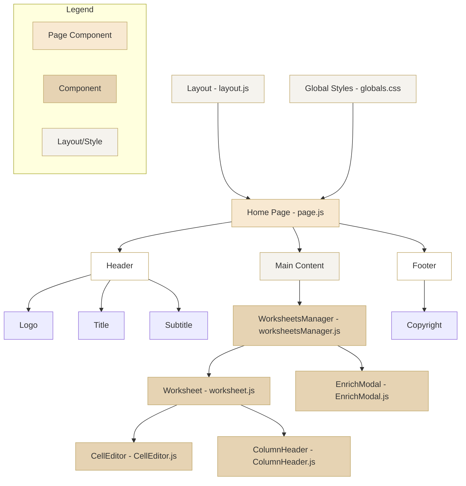

# CharacterQuilt_Interview Task - May 8, 2025

Hi there! My name is Michael Karas.

This repo is intended to showcase the task given by the CharacterQuilt Team.

The task given was to build a Smart Worksheet similar to clay.com or ottogrid.ai.

I chose clay.com as the product of choice for this task. Used AI tools such as Cursor for coding, Chat GPT to generate logo.

## TechStack
- React
- NextJS
- OpenAI & Anthropic API

## Mermaid Chart of Code Structure

